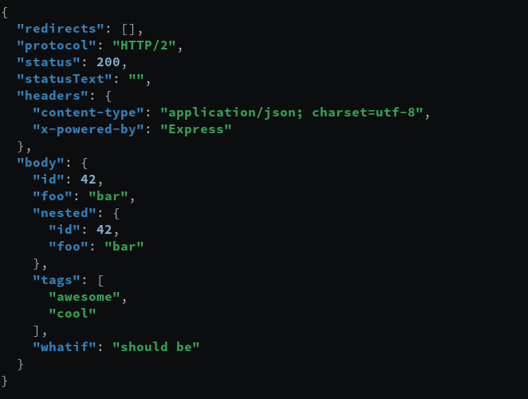
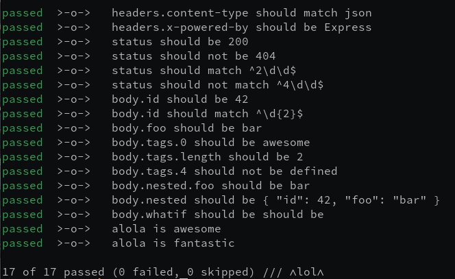

# ᭴lol᭴

[](https://github.com/balazs4/alola/actions?query=workflow%3A.github%2Fworkflows%2Fmain.yaml+branch%3Amaster)
[](https://lgtm.com/projects/g/balazs4/alola/context:javascript)
[](https://github.com/prettier/prettier)
[](https://github.com/semantic-release/semantic-release)
[](https://www.npmjs.com/package/alola)

> your **next** 2-in-1 tool for JSON API




## Features

- converts `curl -Lis` output into JSON (`protocol`, `status`, `statusText`, `headers`, `body`, and `redirects`)
- extends [fx](https://github.com/antonmedv/fx) and turns it into a [test-runner](#advanced-usage) with 'battery-included' checks

## Install

```bash
npm install -g alola
```

## Usage

```bash
curl -Lis <url> | npx alola
```

### Example

```bash
curl -Lis http://dummy.restapiexample.com/api/v1/employee/1 | npx alola
```

```json
{
  "redirects": [],
  "protocol": "HTTP/1.1",
  "status": 200,
  "statusText": "OK",
  "headers": {
    "cache-control": "no-cache, private, max-age=31536000",
    "content-type": "application/json",
    "date": "Mon, 14 Sep 2020 11:02:10 GMT",
    "display": "staticcontent_sol",
    "expires": "Tue, 14 Sep 2021 11:02:09 GMT",
    "host-header": "c2hhcmVkLmJsdWVob3N0LmNvbQ==",
    "referrer-policy": "",
    "response": "200",
    "server": "nginx/1.16.0",
    "vary": "Accept-Encoding,User-Agent,Origin",
    "x-ezoic-cdn": "Miss",
    "x-middleton-display": "staticcontent_sol",
    "x-middleton-response": "200",
    "x-ratelimit-limit": "60",
    "x-ratelimit-remaining": "58",
    "x-sol": "pub_site",
    "content-length": "179"
  },
  "body": {
    "status": "success",
    "data": {
      "id": 1,
      "employee_name": "Tiger Nixon",
      "employee_salary": 320800,
      "employee_age": 61,
      "profile_image": ""
    },
    "message": "Successfully! Record has been fetched."
  }
}
```

## Advanced usage

`alola` comes with an `fx` extension in order to make some checks on your json.

### Features

- reports the result with details
- no bail-out; it runs every assertions
- CI-friendly: process exit code is always the number of failed testcases

### Prerequisites

- install [fx](https://github.com/antonmedv/fx#install)
- add the following content to your [~/.fxrc](https://github.com/antonmedv/fx/blob/master/DOCS.md#using-fxrc)

  ```javascript
  global.alola = require(`alola/fx`)();
  ```

- to be able require global modules make sure you have correct `NODE_PATH` env variable.

  ```bash
  export NODE_PATH=`npm root -g`
  ```

### Example

```bash
curl -Lis http://dummy.restapiexample.com/api/v1/employee/1 \
  | alola \
  | FX_APPLY=alola fx \
    'status should not be 404' \
    'headers.content-type should match json' \
    'body.status should be success' \
```

Another example see [e2e.sh](./e2e.sh)

> :bulb: You can define an alias for that in your shellrc (e.g. zshrc or bashrc)
> `alias alola-fx='FX_APPLY=alola fx'`

### API

`alola fx` offers a high-level api for assertions using 'human-language' to make checks easy to read and write. It means instead of writing functions, you literally write down your expectation.
In most cases you do not have worry about the quotes or escaping issues.

#### Anatomy of an alola fx assertion

```
<key> <verb> <expectation>
```

- `key` is a value selector on the input json. \
  example: `status`, `body.members.0.id`, `headers.x-powered-by`, `whatever.my.json.structure.is`

- `verb` is a specific 'trigger phrase' which tells alola what to do.
- `expectation` is any kind of expected value, depending on verb.

##### Battery-included verbs

- `should be` or `should not be`

  > it checks explicit the actual value with the expected value

  ```bash
  'status should be 200'                            # assert.deepStrictEqual(json.status, 200)
  'status should not be 404'                        # assert.deepStrictEqual(json.status, 200)
  'body should be {"name": "John Doe", "age": 42}'  # assert.deepStrictEqual(json.body, {"name": "John Doe", "age": 42})
  ```

- `should match` or `should not match`
  > instead of explicit check, you can pass a regex as expectation
  ```bash
  'status should match 2\d\d'         # will pass when status is "ok"
  'status should not match 4|5\d\d'   # will pass when status is neither client nor server error
  ```

#### Bring your own assertions

In some case you might want to define your own assertions.
The only thing you have to do is add an `object` as a function parameter to the `alola/fx`.

```javascript
// .fxrc
global.alola = require('alola/fx')({
  'status is ok-ish': (json, assertion) => {
    const status = json.status.valueOf();
    if (status >= 200 && status < 300) return;
    throw new Error(`${status} is not ok.`);
  },
  'this is an optimistic check': (json, assertion) => {
    console.log({ json, assertion }); // inspect the paramters
    return;
  },
  'you can define (some|any|few) regex as well': (json, assertion, regex) => {
    console.log({ json, assertion, regex }); // inspect the paramters
    return;
  },
});
```

```bash
curl -Lis http://dummy.restapiexample.com/api/v1/employee/1 \
  | alola \
  | FX_APPLY=alola fx \
    'status should not be 404' \
    'status is ok-ish' \
    'this is an optimistic check' \
    'you can define some regex as well' \
    'you can define any regex as well'

```

The keys of this object are your own custom assertions, and it should implement a function.
This assertion function get 2 parameters:

- the raw `json` itself as it would be just an `fx` call
- the `assertion` which triggered this execution

If the custom assertion contains any regex, a third parameter will be passed to the function, which contains a `pattern` and a `match` key-value.

- `pattern` is your regex
- `match` the result of the pattern regex

### Configuration

You can configure the `alola` function with environment variables

| Environment variable | Description     | Default value | Possible values  |
| -------------------- | --------------- | ------------- | ---------------- |
| `ALOLA_FX_REPORTER`  | result reporter | text          | text,json,silent |

## Author

balazs4 - https://twitter.com/balazs4
